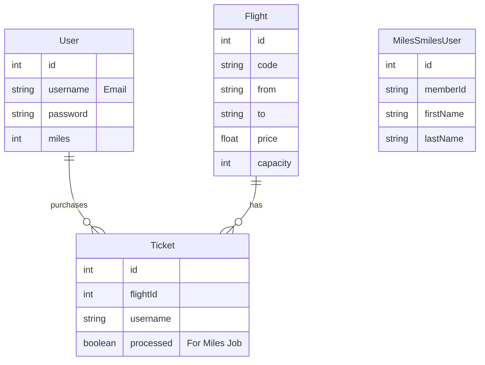

# Flight Booking Microservices Application
GITHUB REPO: https://github.com/dilagencaga/Flight-booking-app.git
YOUTUBE VIDEO: https://youtu.be/17yjX3Pk4UA
## 🚀 Deployed Application URLs
**(Please replace these with your actual Render URLs)**

*   Client UI: https://client-y4za.onrender.com
*   API Gateway: https://gateway-5k3z.onrender.com
*   Flight Service: https://flight-service-j94a.onrender.com
*   ML :https://ml-service-74v1.onrender.com
*   search-service: https://search-service-y0s2.onrender.com
*   notification-service: https://notification-service-oy6p.onrender.com

---

## 📖 Project Overview
This project is a comprehensive **Airline Ticketing System** built using a **Microservices Architecture**. It separates concerns into distinct services for flight management, search capabilities, notifications, and machine learning-based price prediction, all orchestrated via an API Gateway.

## 🏗️ Architecture & Design

### Technologies Used
*   **Backend:** Node.js (Express), Python (Flask)
*   **Frontend:** HTML5, CSS3, Vanilla JavaScript (Served via Nginx)
*   **Database:** PostgreSQL (Relational Data), Redis (Caching)
*   **Message Broker:** RabbitMQ (Asynchronous Events)
*   **Deployment:** Render.com (Dockerized Services)

### Microservices Breakdown
1.  **Gateway Service (Node.js)**
    *   **Port:** 3000
    *   **Role:** Single entry point for the frontend. Routes requests to appropriate backend services (`/v1/flights` -> Flight Service, `/v1/search` -> Search Service, etc.).
    *   **Pattern:** API Gateway Pattern.

2.  **Flight Service (Node.js + PostgreSQL)**
    *   **Port:** 3001
    *   **Role:** Core business logic. Manages Flights, Users, Tickets, and Miles.
    *   **Key Feature:** Publishes events (`TICKET_SOLD`, `MILES_ADDED`) to RabbitMQ.
    *   **Cron Job:** Simulates nightly batch processing to award miles 3 minutes after ticket purchase.

3.  **Search Service (Node.js + Redis)**
    *   **Port:** 3002
    *   **Role:** High-performance flight search.
    *   **Pattern:** Caching Pattern. Checks Redis first; if miss, queries DB and updates Redis (TTL 60s).

4.  **Notification Service (Node.js + RabbitMQ)**
    *   **Port:** 3003
    *   **Role:** Consumes events from RabbitMQ and sends emails via Gmail SMTP.
    *   **Key Feature:** Includes retry logic and fallback logging if SMTP is blocked by cloud provider.

5.  **ML Service (Python + Flask)**
    *   **Port:** 5000
    *   **Role:** Predicts future flight prices using a linear regression model based on historical data.

### Data Models (ER Diagram)



---

## ⚠️ Issues Encountered & Deliverables

### 1. SMTP Port Blocking on Cloud
*   **Issue:** Render (and AWS) blocks outbound traffic on standard SMTP ports (587, 465, 25) for free/trial tiers to prevent spam. This caused `ETIMEDOUT` errors in the Notification Service.
*   **Solution:** 
    *   **Primary:** Upgraded to Render 'Starter' plan to unblock ports (Port 465 SSL).
    *   **Fallback:** Implemented a circuit-breaker style fallback log. If the email fails to send (timeout), the service catches the error and prints the full email content to the console logs. This ensures the *business process* completes even if the *delivery mechanism* is blocked.

### 2. Service Discovery (502 Bad Gateway)
*   **Issue:** Hardcoded `localhost` URLs caused failures in the cloud environment.
*   **Solution:** Implemented environment variable injection (`FLIGHT_SERVICE_URL`, etc.) in `render.yaml` and used `entrypoint.sh` for the frontend to dynamically inject the API URL at runtime.

### 3. Redis Connectivity
*   **Issue:** Search Service would crash if Redis was temporarily unavailable.
*   **Solution:** Added extensive error hadling and connection checks. Service can now start without Redis and will gracefully degrade (bypass cache) if Redis is down.

---

## 🛠️ Local Setup Instructions

1.  **Prerequisites:** Docker Desktop installed.
2.  **Run System:**
    ```bash
    docker-compose up --build
    ```
3.  **Access:**
    *   Frontend: http://localhost:8080
    *   Gateway: http://localhost:3000

---

*This README was generated as part of the Final Project deliverables.*
